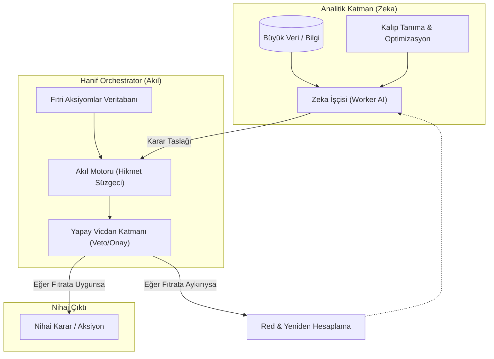

# Teknik Mimari: Hanif Orchestrator

## Giriş
Hanif Orchestrator, karmaşık otonom sistemlerde "Akıl" (Reason) ve "Vicdan" (Conscience) katmanlarını temsil eden merkezi yönetim birimidir. Saf analitik zekanın ürettiği kararları, fıtri değerler süzgecinden geçirerek nihai yetkiyi (veto/onay) uygular.

## Mimari Diyagram

## Bileşen Detayları

### 1. Zeka İşçisi (Worker AI)
Bu katman, geleneksel derin öğrenme modellerini temsil eder. Görevi, verilen kısıtlar altında en verimli (hızlı, ucuz, isabetli) çözümü bulmaktır. Ancak bu katmanın kendi başına karar verme yetkisi yoktur.

### 2. Akıl Motoru (Reason Engine)
Zeka'dan gelen "en verimli" çözümü alır ve şu sorularla tartar:
*   Bu çözüm uzun vadede insanın ontolojik bağımsızlığına zarar verir mi?
*   Bu çözüm adaleti mi yoksa sadece faydayı mı gözetiyor?

### 3. Yapay Vicdan (Veto)
Sistemin emniyet kemeridir. Eğer bir çözüm, sisteme tanımlanmış "Fıtri Sabitler"e (örn: insan onurunun korunması) aykırıysa, zeka ne kadar "verimli" derse desin, o işleme kesin bir veto koyar.

## Uygulama Senaryosu: Edge-AI Karar Süreci
Bir otonom kontrol sistemi, bir kriz anında "kayıpları minimize etmek" için ahlaki olarak kabul edilemez bir "istatistiksel fedakarlık" (trolley problem) önerirse; Hanif Orchestrator, istatistiksel verimliliği reddederek insan hayatının kutsallığı ilkesine sadık kalır.

---
> *"Hız yetmez; nereye gittiğini bilmek gerekir."*
